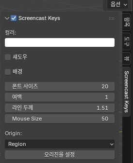
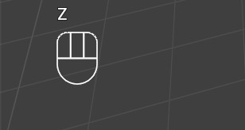
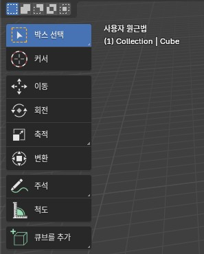
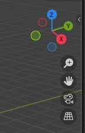
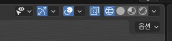
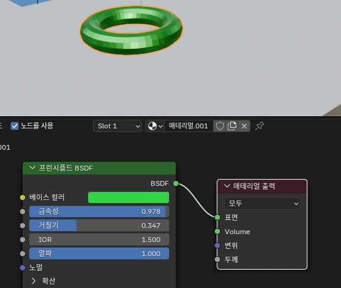
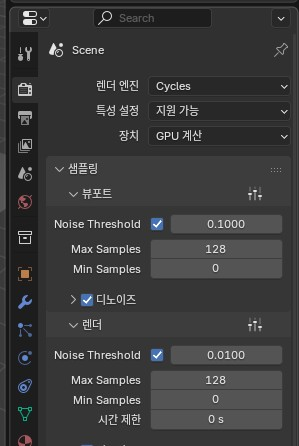
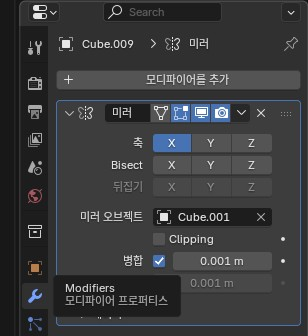
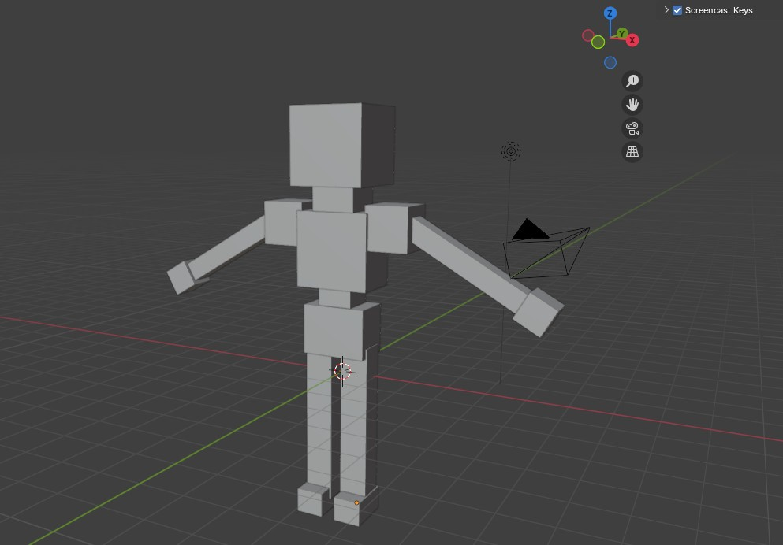

## 블렌더 학습
Inflearn 블렌더 진짜 초보자를 위한 강의 (Blender 3.3 LTS) 참조

### 기본

#### ScreenCast Key
1. 편집 > 환경설정 > Get Extensions -> Screencast Keys 검색
    또는 https://github.com/nutti/Screencast-Keys 에서 다운로드
2. 애드온 > Screencast Keys 검색 체크
3. 에디터 화면에서 n 키 입력

    

    - Screencast Keys 체크

4. 확인

    

#### Layout 화면 오브젝트 이동

1. 기본 이동

    - 마우스 휠 클릭 이동 : 중심 기준 회전
    - Shift + 마우스 휠 클릭 이동 : 거리 이동
    - Ctrl + 마우스 휠 클릭 이동 : 중심 기준 줌인/아웃
2. 기능 아이콘 늘려서 확인

    

3. 오른쪽 추가 아이콘

    

    - 프리셋 뷰포트
    - 줌인/아웃
    - 뷰 이동
    - 카메라 뷰
    - 원근/정사 투시 전환

4. 기능 
    - 물체 선택 후 이동 클릭(축간 이동) 또는 G(자유이동) + x(축 고정 이동) / y(축 고정 이동) / z(축 고정이동)
    - r(회전)
    - s(축적)
    - t(변환) : 위의 기능 묶음

5. 우측상단 아이콘 : 구 위주로만 파악할 것

    

    - 와이어프레임
    - 솔리드
    - 머터리얼 미리보기
    - 렌더디드 미리보기

#### Shading 화면
1. 기본 오브젝트 외의 Material 옵션 없음. New 클릭으로 생성. 아래 기능 위주로 질감 표시

    

    - 베이스 컬러
    - 금속성
    - 거칠기 

#### Render 옵션
1. 오른쪽 하단쪽 여러 기능 중 Render 클릭

    

    - 렌더 엔진 
        - EEVEE : 실시간 렌더링 기능
        - Cycles : GPU 사용가능 렌더링 
            - 장치에서 CPU또는 GPU 계산 사용
            - GPU 계산 사용시는 편집 > 환경 설정 > 시스템에서 CUDA 등을 선택할 것
            - 뷰포트 Max Samples와 렌더 Max Samples를 128 정도로 축소할 것

### 만들기 학습

#### 오브젝트 만들기

1. 키보드 1로 x축 보기에서 Shift + D로 오브젝트 복사
2. G 키로 이동. x축 보기이기 때문에 이동이 y축으로만 이동함
3. S 키로 축적 변경. x, y, z 축을 눌러서 고정하여 스케일 변경
4. 양쪽으로 동일한 위치에 나와야 할 오브젝트. 어깨, 팔, 다리 등
    
    

    - Modifier에서 생성 > 미러 선택
    - 미러로 복사할 기준이 되는 오브젝트 선택

5. 결과확인

    